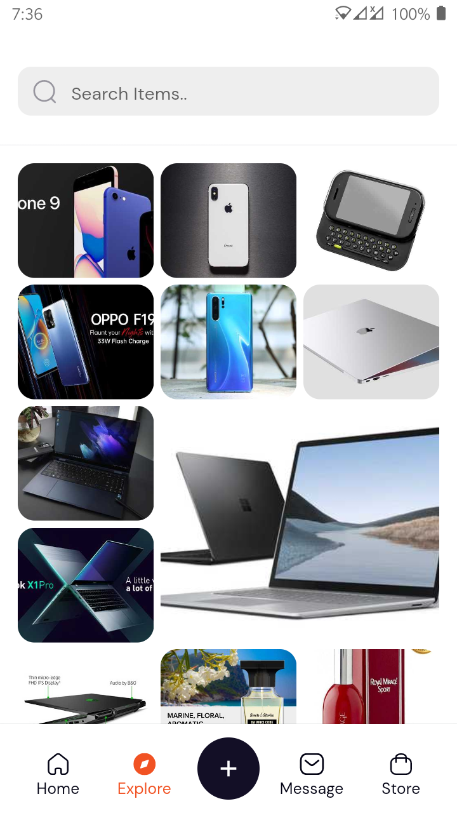
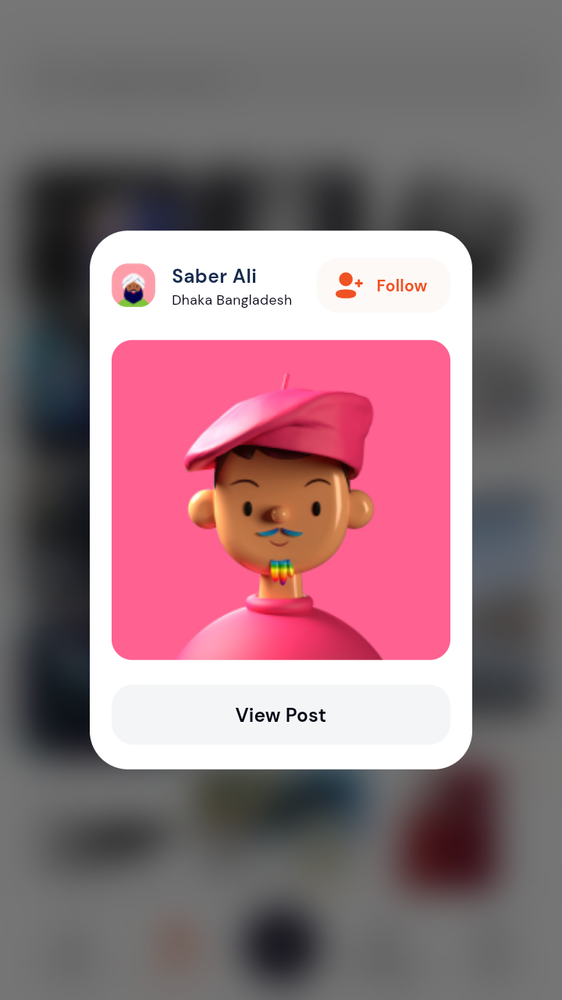
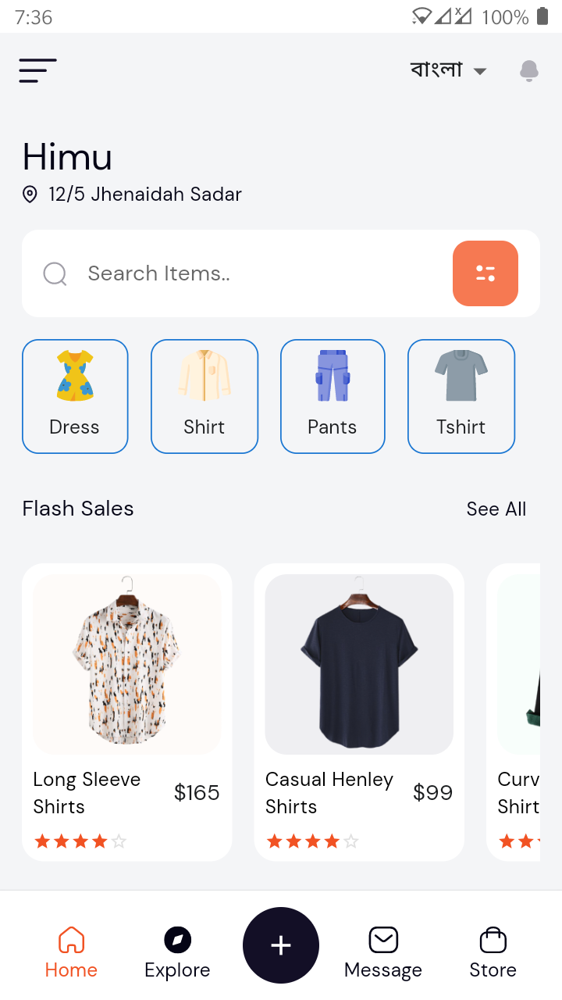

# Zainik Lab UI Challange


## Getting Started

1. Clone the repository:

```
git clone https://github.com/arrahmanbd/zainiklab_ui_challange.git
```

2. Open the project in your preferred IDE, such as Android Studio or Visual Studio Code.

3. Install the required dependencies:

```
flutter pub get
```
4. Run the project:

## Features

1. Rest API Implimented.
2. Use GetX State Management.
3. Implemented Material3 Design Components.
4. Implemented Flutter Animations.
5. Implemented Flutter Localization.
6. Implemented Dynamic Grid View.
7. Implemented Extra 4 Page accooroding this Design

## Screenshot









## Watch
[](https://youtu.be/gAdmJMu6Uiw "UI")

## Test Apk
[](screenshot/app-release.apk)


#Clone and run the command

```
adb install screenshot/app-release.apk
```


## 🔗 Follow
[](https://arrahmanbd.github.io/)
[](https://www.linkedin.com/in/arrahmanbd)
[](https://www.github.com/arrahmanbd)

## License

This project is licensed under the MIT License - see the [LICENSE](LICENSE) file for details.